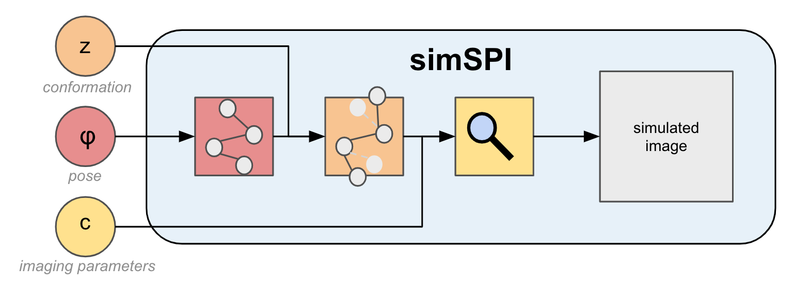

# simSPI

Methods and tools for simulating SPI data.

# Download

First download:

    git clone https://github.com/compSPI/simSPI.git

Then, create a conda environment with the required dependencies using the `environment.yml` file as follows:

    conda env create --file environment.yml

Finally, install simSPI in this environment:

    conda activate simSPI
    pip install -e .

Alternatively, pull the simSPI container from [DockerHub](https://hub.docker.com/repository/docker/fpoitevi/simspi)

# Contribute

We strongly recommend installing our pre-commit hook, to ensure that your code
follows our Python style guidelines. To do so, just run the following command line at the root of this repository:

    pre-commit install

With this hook, your code will be automatically formatted with our style conventions. If the pre-commit hooks black and isort mark "Failed" upon commit, this means that your code was not correctly formatted, but has been re-formatted by the hooks. Re-commit the result and check that the pre-commit marks "Passed".

Note that the hooks do not reformat docstrings automatically. If hooks failed with an error related to the documentation, you should correct this error yourself, commit the result and check that the pre-commit marks "Passed".

See our [contributing](https://github.com/compspi/compspi/blob/master/docs/contributing.rst) guidelines!
